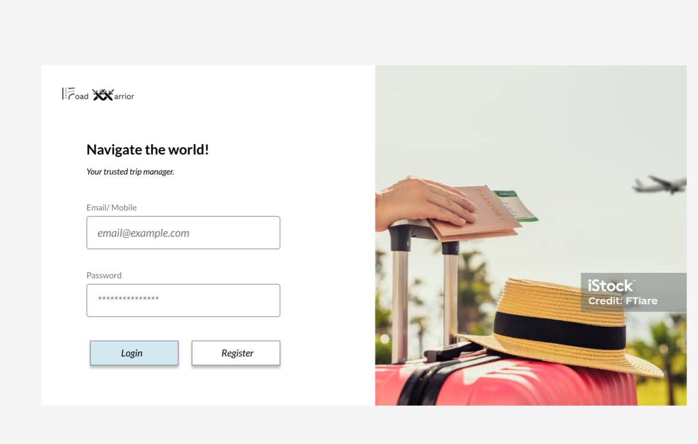
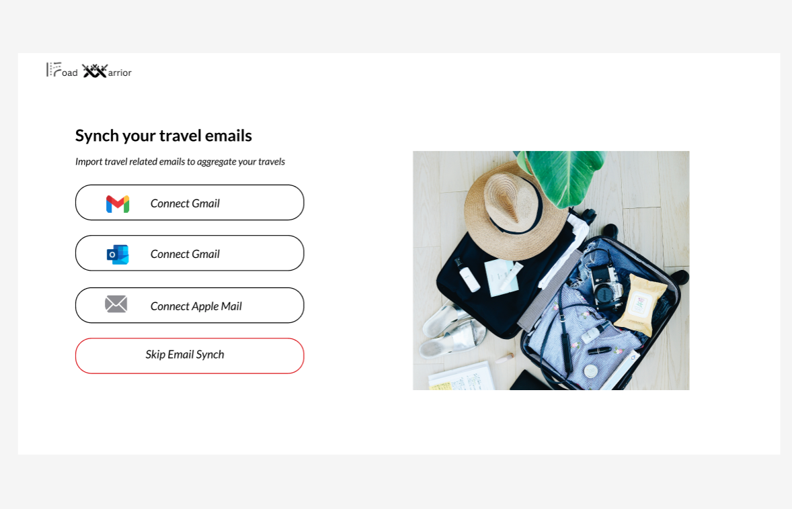
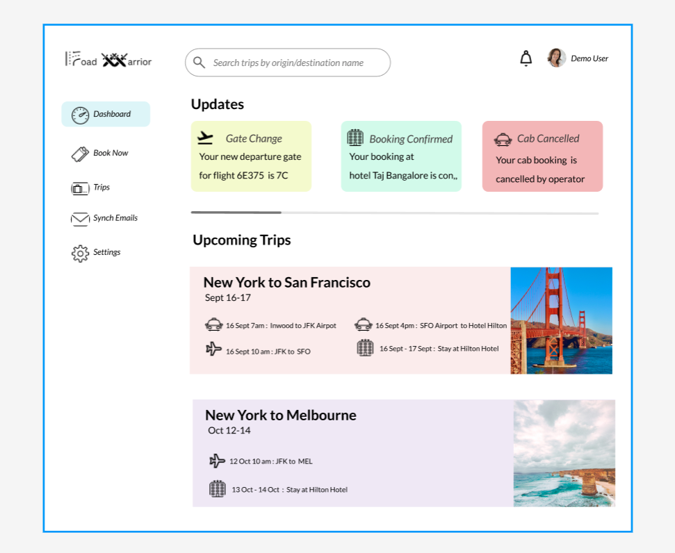
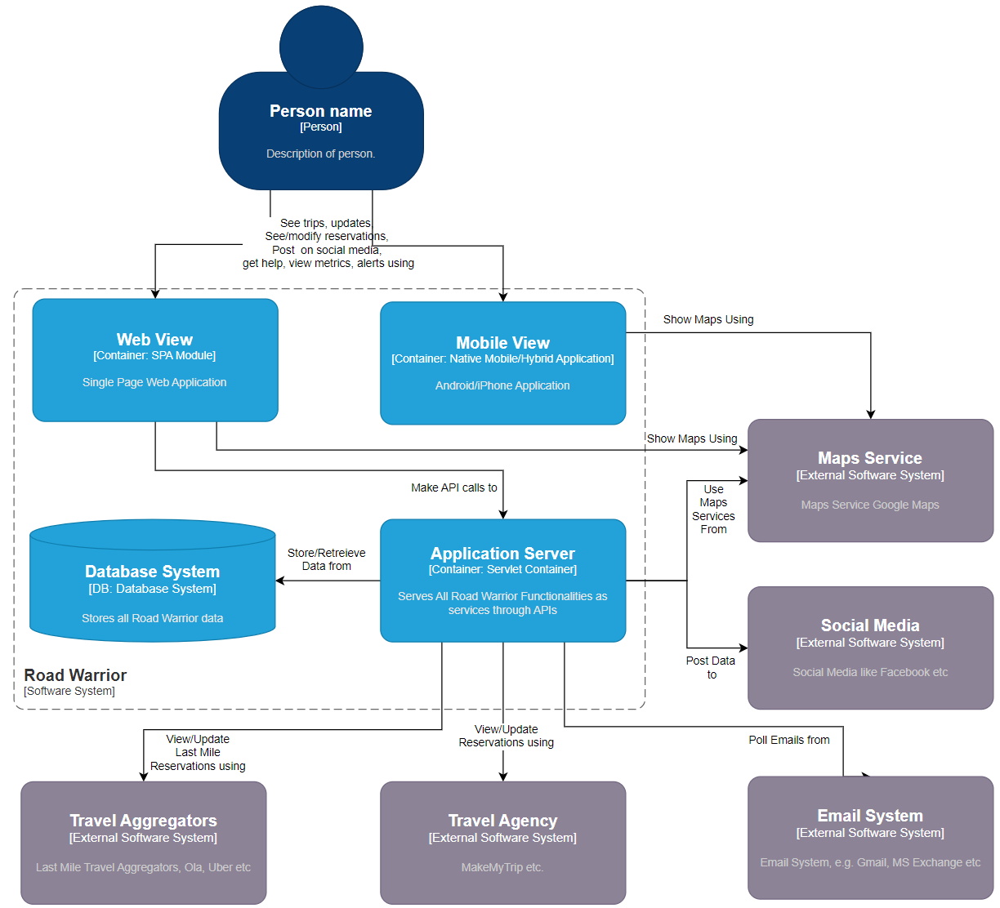
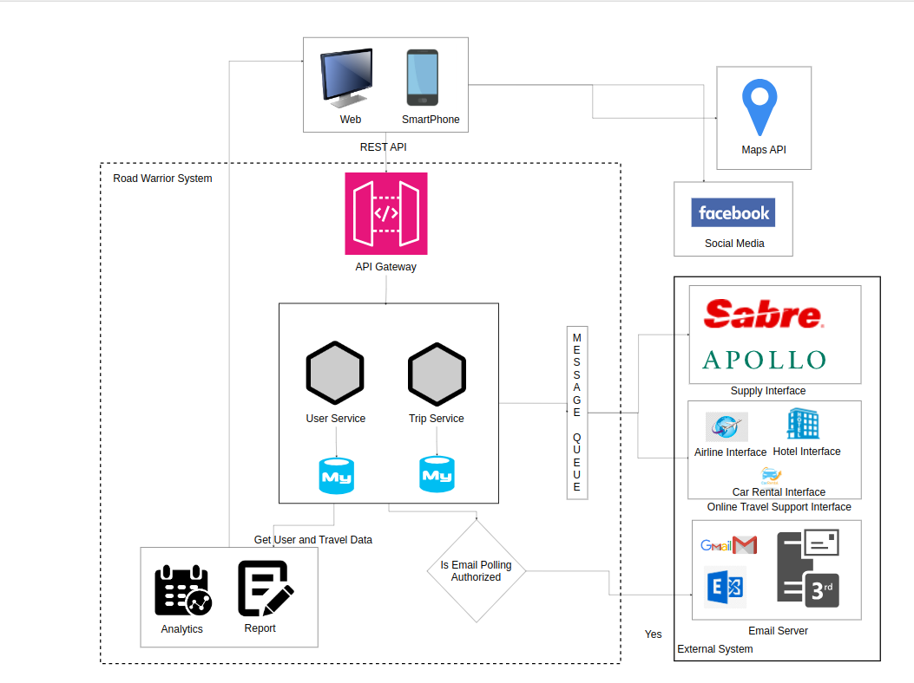

# Road Warrior Architecture
**By Laerdal Techies**
## Index
```
1. Introduction
2. Requirements
   1.Functional
   2.Performance
   3.Scalability
3. MVP Goals
4. Web/Mobile User Interface   
5. User Journeys
   1.Email Polling
   2.Travel Alerts & Notifications
   3.On Trip Assistance
6. Architecture
   1.Context
   2.Containers
   3.Components
   4.Physical Architecture   
7. ADRs
````
## 1. Introduction
Road Warrior is a next-generation one-stop solution for on-the-go travellers trip management. No more juggling around with different emails, apps, external agencies etc.. 
Road Warrior presents a timely and holistic dashboard of all the traveller's reservations, trips and other relevant information that assist users in planning, organizing and managing their trips.
The user experience in Road Warrior effectively makes their trip a pleasurable experience. 
It is a rich platform with support for both Web and Mobile platforms.


## 2. Requirements

*High Level Requirement Details*
* Ability to track and maintain trips consisting of airline, hotel, and car rentals of a user.
* Ability to poll and import selected trip related data of the user from the emails chosen.
* System should provide a dashboard for viewing the active trips of the user with options to search and group.
* Ability to share the trip related information on social media sites based on user selected targeting.
* System should provide an interface to integrate with travel agencies to provide real time updates of the reservations, quick issue resolution.
* Ability to add or modify reservations manually on the dashboard.
* System should be able to provide a summary of the user journey with a variety of metrics like “Miles Covered”, “Points Achieved”.
* Ability to show notifications and alerts on trips on web and mobile devices.
* System should provide analytics capabilities to suggest future trips, location and stay preferences.
* System should provide the capability of integrating with multiple GDS systems to manage trips online.

### 1. Functional Requirements
* R1: Poll email looking for travel-related emails.

* R2: Filter and whitelist certain emails

* R3: System must interface with the agency’s existing airline, hotel and car rental interface system to update travel details (delays, cancellations, updates, gate changes etc)

* R4: Customers should be able to add, update or delete existing reservations manually.

* R5: Dashboard items should be able to be grouped by trip, and once the trip is complete the items should automatically be removed from the dashboard.

* R6: Users should also be able to share their trip information by interfacing with standard social media sites or allowing targeted people to view your trip.

* R7: Richest user interface possible across all deployment platforms.

* R8: Provide end-of-year summary reports for users with a wide range of metrics about their travel usage

* R9: Road Warrior gathers analytical data from users trips for various purposes - travel trends, locations, airline and hotel vendor preferences, cancellation and update frequency, and so on

* R10: System must integrate seamlessly with existing travel systems (i.e, SABRE, APOLLO)

* R11: Must integrate with a preferred travel agency for quick problem resolution (help me!)

* R12: Must work internationally

### 2. Performance
* P3: Updates must be available in the app within 5 minutes of an update.

* P4: Users must be able to access the system at all times (max 5 mins per month of unplanned downtime)

* P5: Travel updates must be presented in the app within 5 minutes of generation by the source

* P6: Response time from web (800ms) and mobile (First-contentful paint of under 1.4 sec)

### 3. Scalability
* S1: The system must support 2 million active users per week.

* S2: The system must store at least 15 million user accounts.

## 3. MVP Goals


## 4. Web/Mobile UX




## 5. User Journeys
### 1. Email Polling
### 2. Travel Alerts & Notifications
### 3. On Trip Assistance

## 6. Architecture
### 1. Context


### 2. Containers

### 3. Components

### 4. Physical Architecture


## 7. ADRs
#### ADR 1.Microservice Architecture
* Status: proposed 
* Context: The architecture which is being used should be scalable and fault tolerant and also should support scalability.
* Decision: The architecture that can be adopted is microservices. Since it is easier to deploy, highly scalable, improved data security and it has outsourcing flexibility.
* Consequences: Since microservice architecture contains independent services, the boundary for each service should be defined. 

#### ADR 2. Email Polling
* Status: Proposed
* Context: Applications had to connect to mail servers and poll for emails to arrive in a mailbox and then process the messages inline and perform actions on the message. 
* Decision: We use an OCR with cloud services which will help in polling the emails from the mail server and scan through the data to get trip information which can be viewed on the UI.
* Consequences: We need to evaluate the OCR with cloud services as the workflow should not be resulting in missing messages.

#### ADR 3. Third party Integrations
* Status: Proposed
* Context: Applications need to integrate with other external systems like GDS and other travel agencies in order to manage trip information.
* Decision: Since we have multiple external systems which needs to be integrated in order to capture the trip information, we are using queues which will subscribe to the events that are being published from the external system.
* Consequences: Since we are using a message queue for capturing the information from an external system, we should be implementing the retry mechanism.